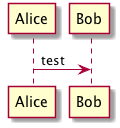

# Install PlantUML on MacOS

Instructions to install PlantUML onto MacOS and run it with Visual Studio Code.

## Install PlantUML

1. Open a command prompt.
1. Install Home Brew (if you do not have it).

  ```sh
  /usr/bin/ruby -e "$(curl -fsSL https://raw.githubusercontent.com/Homebrew/install/master/install)"
  ```

1. Install latest Java (if you do not have it).

  ```sh
  brew cask install java
  ```
  
1. Download [plantuml.jar](//sourceforge.net/projects/plantuml/files/plantuml.jar/download)
1. Copy plantuml.jar to a local folder (e.g., `mkdir -p ~/bin/plantuml && cp ~/Downloads/plantuml.jar ~/bin/plantuml`)
1. Install Graphviz (PlantUML depends on this for some of its graphing capabilities).

  ```sh
  brew install graphviz
  ```
  
1. Ensure the following lines are in `~/.bashrc`:

  ```sh
  export JAVA_HOME='/Library/Java/JavaVirtualMachines/jdk1.8.0_102.jdk/Contents/Home'
  export PLANTUML_JAR='$HOME/bin/plantuml/plantuml.jar'
  export GRAPHVIZ_DOT='/usr/local/bin/dot'
  ```
  
  _Note: You may need to change the exact folder locations. For example, use the actual folder for the jdk, which you should
  find at `/Library/Java/JavaVirtualMachines`._
  
## Test your installation 

1. Create a local folder and copy the [test file](test.txt) into it:

1. Enter the following command:

  ```sh
  java -jar $PLANTUML_JAR test.txt && open test.png
  ```
  
1. You should see an image like this one:

  

## Integrate with Visual Studio Code 

1. Download and install [Visual Studio Code](//code.visualstudio.com) if you do not already have it.
1. Open Visual Studio Code.
1. Open the Extenions panel by clicking the Extensions icon on the left toolbar or by pressing Cmd+Shift+P and entering `ext install` in the search box.
1. Search for and install the extension `okazuki PlantUML`. There are others, but this is the extension targetted by these instructions. I may review one of the others in the future.
1. Restart Visual Studio Code.

## Your First Diagram in Visual Studio Code

1. Open [test.txt](test.txt)
1. Press Cmd+Shift+P, type `plantuml preview`, and press Enter.

## References
 - [HomeBrew](//brew.sh)
 - [PlantUML Home](//plantuml.com/)
 - [Visual Studio Code](//code.visualstudio.com)
  
